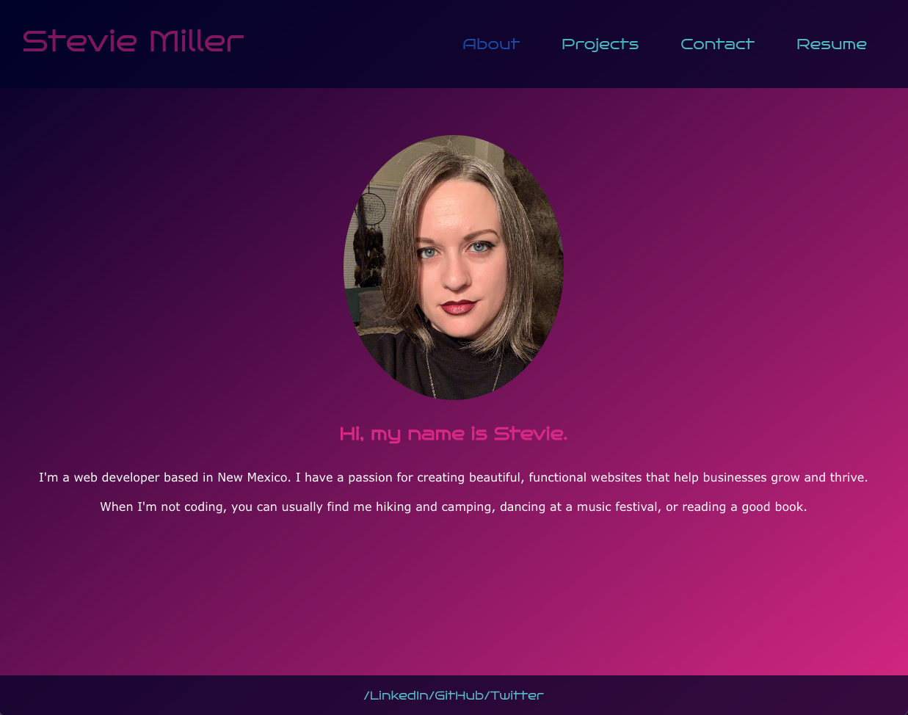
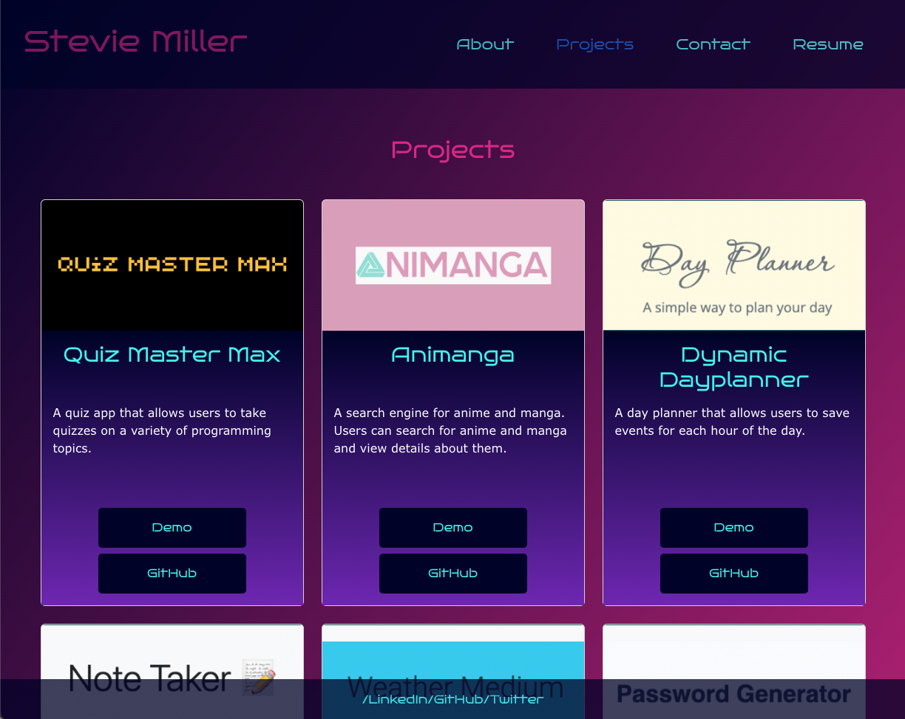

# Portfolio Remix

## Table of Contents

- [Description](#description)
- [License](#license)
- [Questions](#questions)

## Description

This is a revision of my web development portfolio built using React. It includes an about page, a page demonstrating projects I've created, a contact form, and a link to my resume. 

[Click here to view the deployed link](https://steviemiller.github.io/portfolio-remix/)

## License

This project uses MIT
[Click here to view license](https://opensource.org/licenses/MIT)

## Questions

- Author: Stevie Miller
- GitHub: [StevieMiller](https://github.com/StevieMiller)
- Email: stephanie.miller@carlsbadschools.net
